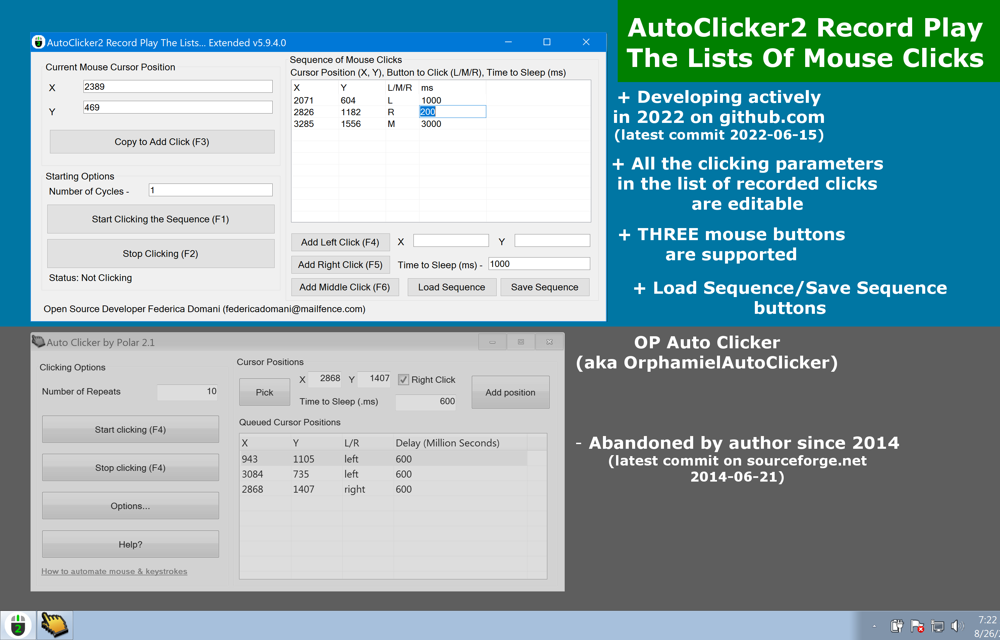

# AutoClicker2 Record Play The Lists Of Mouse Clicks

## Open source mouse auto-clicker to record, edit, import, debug, and playback the whole sequences of mouse clicks with 5 mouse buttons. Advanced 2022 fork of frozen or proprietary [www.opautoclicker.com](https://www.opautoclicker.com), [sourceforge.net](https://sourceforge.net/projects/orphamielautoclicker/), [www.autoclicker.io](https://www.autoclicker.io), [www.autoclicker.org](https://www.autoclicker.org), [www.macrorecorder.com](https://www.macrorecorder.com), [www.remouse.com](https://www.remouse.com), etc.

### Latest stable version 5.9.4.0 ([download](https://filedn.com/llBp1EbMQML0Hdv9A9SVo6b/Setup-AutoClicker2-Record-Play-The-Lists-v5.9.4.0.exe))

> Updated Jun 15 2022. [Quick Start](https://www.open-source.tech/AutoClicker2-Record-Play-The-Lists-Of-Mouse-Clicks/index.html#QuickStart) added to the Official Site. New version [5.9.4.0]((https://filedn.com/llBp1EbMQML0Hdv9A9SVo6b/Setup-AutoClicker2-Record-Play-The-Lists-v5.9.4.0.exe)) has been released. AutoClicker2Ex has got "Load Sequence" and "Save Sequence" buttons.

AutoClicker2 Record Play The Lists Of Mouse Clicks supports record, edit, import, export, and playback the whole sequences of mouse clicks.

Yes, this is the only mouse auto clicker with strong record/edit/play capabilities for professional work with sequences of mouse clicks.
This is the only open source project that has regular commits into source tree in 2022.
Perfectly compatible with Windows 7, Windows 8, Windows 10, [Windows 11](https://www.microsoft.com/en-us/software-download/windows11), both 32-bit and 64-bit systems.

AutoClicker2 Record Play The Lists Of Mouse Clicks is a new open source replacer of frozen, buggy, suspicious proprietary projects such as
[Orphamiel Auto-Clicker](https://sourceforge.net/projects/orphamielautoclicker/),
[OP AutoClicker](https://www.opautoclicker.com),
[AutoClicker.io](https://autoclicker.io),
[Chrome Browser AutoClicker plugin](https://chrome.google.com/webstore/detail/auto-clicker/cpedeojecpbkcomgcolphimkjdnikbck?hl=en),
[AutoClicker.org](https://www.autoclicker.org),
[GS Auto Clicker](https://gs-auto-clicker.en.softonic.com),
[AutoClicker.pro](https://autoclicker.pro),
[Auto Clicker Typer](https://www.asoftwareplus.com/auto-clicker-typer.html),
[Macro Recorder](https://www.macrorecorder.com),
[ReMouse](https://www.remouse.com) and many others.

Note all of that programs are closed-source clones of each other, have not been updated for
many years and may contain trojan, malware or virus code as well as huge amount of embedded unwanted Ads and spy agents.

Unlike suspicious "free" but proprietary or abandoned programs mentioned above,
AutoClicker2 Record Play The Lists Of Mouse Clicks is 100% open source project, and supports professional gaming in
[Roblox](https://www.roblox.com),
[Minecraft](https://en.wikipedia.org/wiki/Minecraft),
[Cookie Clicker](https://en.wikipedia.org/wiki/Cookie_Clicker),
[Candy Crush Saga](https://en.wikipedia.org/wiki/Candy_Crush_Saga), etc.

Also AutoClicker2 import/export features over mouse clicking sequences discover professional
[Quality Assurance](https://en.wikipedia.org/wiki/Quality_assurance) usage.

The program has built-in updater service under construction that may perform additional scientific tasks when your CPU is idle with very tiny CPU and Internet usage. See source code of the installer. The application uninstalls clearly and is NOT a virus or malware. You may switch to the installers without update service and back with [in any moment](https://github.com/federicadomani/AutoClicker2-Record-Play-The-Lists-Of-Mouse-Clicks/blob/master/Installer/README.md).

As its predecessors, AutoClicker2 is a full-fledged autoclicker with two modes of autoclicking, at your dynamic cursor location or at a prespecified location. The maximum amounts of clicked can also be set (or left as infinite).

* Hotkeys work in the background for convenience.
* Your settings are now saved from your last session so you only need to enter them once (includes last fixed location).
* Added double clicking and triple clicking.
* Not only Left, Righ, and Middle mouse buttons are supported for clicking, but all FIVE mouse buttons of any professional gaming mouse.

No more performing mouse clicks manually!
With AutoClicker2 Record Play The Lists Of Mouse Clicks, you can automate the task of clicking repeatedly on a particular point on the PC screen.
Depending on the target point and clicking speed, number of clicks, mouse button, and other parameters, an action will be performed
on your PC display on a fixed location, or through a sequence of mouse clicks you previously recorded, edited, and debugged.

You can use this software to continuously automate mouse clicks on any part of PC display and can easily keep the automated tasks running over night or few days.

Formerly "AutoClicker2 Record-Play for Windows" and "RPG AutoClicker Professional Suite for Windows" - that names one can see on old screenshots.

## Official Site for News and Downloads

### [www.open-source.tech/AutoClicker2-Record-Play-The-Lists-Of-Mouse-Clicks/](https://www.open-source.tech/AutoClicker2-Record-Play-The-Lists-Of-Mouse-Clicks/)

Quick download the latest Windows installer version 5.9.4.0:

[Setup-AutoClicker2-Record-Play-The-Lists-v5.9.4.0.exe](https://filedn.com/llBp1EbMQML0Hdv9A9SVo6b/Setup-AutoClicker2-Record-Play-The-Lists-v5.9.4.0.exe).

## Youtube video: how to install and use

How to download, install and use AutoClicker2 Record Play The Lists Of Mouse Clicks.

https://youtu.be/jscqOm4OeKM

## More info from community fun site

According to [top-10-mouse-auto-clickers.best](https://top-10-mouse-auto-clickers.best/AutoClicker2-Record-Play-The-Lists-Of-Mouse-Clicks/),
AutoClicker2 Record Play The Lists Of Mouse Clicks is the world's top 2 mouse auto clicker application in 2021.
They recognize AutoClicker2 Record Play as a full-fledged autoclicker with two modes of auto-clicking, at your dynamic cursor location or at a prespecified location. The maximum amounts of clicks can also be set (or left infinite). Hotkeys work in the background for convenience. AutoClicker2 automates your mouse clicks at certain points. It is used for various video games and other applications. It can create, record and playback a macro of any critical combinations you press into your keyboard and mouse. AutoClicker2 is a task automation software that saves you from the trouble of repeatedly clicking on the screen. It is an actively developed open source project with GitHub stars and downloads growing dramatically.
Also they have written
an extended review on AutoClicker2 Record Play The Lists Of Mouse Clicks [there](https://top-10-mouse-auto-clickers.best/AutoClicker2-Record-Play-The-Lists-Of-Mouse-Clicks/).

## Screenshots

* AutoClicker2 Record Play The Lists Of Mouse Clicks vs. Op AutoClicker (aka OrphamielAutoClicker) - Single Clicking Mode.

* AutoClicker2Ex Record Play The Lists Of Mouse Clicks vs. Op AutoClicker (aka OrphamielAutoClicker) - Group Clicking Mode.

### Previous stable version 5.9.3.2

* AutoClicker2 Record Play The Lists Of Mouse Clicks version 5.9.3.2 - Both apps of the package together in one screen.

* AutoClicker2 Record Play The Lists Of Mouse Clicks version 5.9.3.2 - Sequence of mouse clicks recorded and loaded from a text file.

### Latest stable version 5.9.4.0

* AutoClicker2 Record Play The Lists Of Mouse Clicks version 5.9.4.0 - AutoClicker2Ex (extended app): Sequence of mouse clicks recorded and loaded from a text file.

